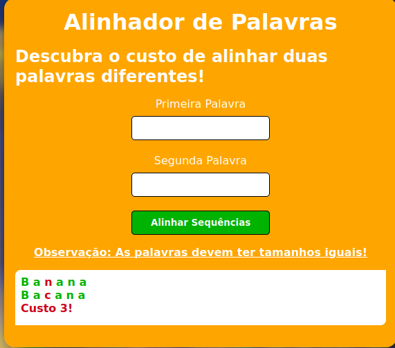

# Alinhamento de Sequência 

**Número da Lista**: 26<br>
**Conteúdo da Disciplina**: PD<br>

## Alunos
|Matrícula | Aluno |
| -- | -- |
| 20/0056603  |  Alex Gabriel Alves Faustino |
| 18/0022512  |  Lucas de Lima Spinosa dos Santos |

## Sobre 

O projeto possui como objetivo mostrar o custo de se alinhar duas sequências de caracteres, usando o algoritmo Alinhamento de Sequência lecionado em aula pelo professor.

Dadas duas palavras informadas pelo usuário, o projeto executa o algoritmo para calcular o custo (seja inserindo espaços em branco, denominados gaps, ou troca de caracteres, denominado mismatch) de deixar as duas palavras iguais.

É feita uma estilização nos caracteres, a depender da situação:

- Caso tenha havido **gap**, ambos os caracteres da posição são coloridos da **azul**;

- Caso tenha havido **mismatch**, ambos os caracteres da posição são coloridos de **vermelho**;

- Caso ambos os caracteres sejam **iguais**, são coloridos de **verde**.

Ao final do processo, é exibido na tela as sequências resultantes e o custo total da operação.

Foi gravado um vídeo explicando melhor o projeto e mostrando ele em funcionamento. [Clique aqui para assistir pelo YouTube](https://youtu.be/uAK-zHGWd10). O vídeo também se encontra no repositório.

## Screenshots




## Instalação 
**Linguagem**: JavaScript<br>

Para rodar o projeto, é necessário que você tenha o Node.js instalado, juntamente com o NPM (Node Package Manager) e o pacote Http-Server.

Para instalar o Node.js (juntamente com o NPM) no Linux, use o comando a seguir:

```bash
sudo apt update
sudo apt install nodejs
```

Para instalar o pacote Http-Server, use o comando a seguir:

```
npm install --global http-server
```

Com tudo isso feito, na pasta do repositório, use o seguinte comando:

```
http-server
```

Isso irá rodar o projeto em duas portas diferentes. Basta abrir qualquer uma delas no navegador para usar a agenda.

## Uso 

Insira uma sequência de caracteres no campo **Primeira Palavra** e outra sequência no campo **Segunda Palavra**.

Vale notar que elas devem ter o mesmo tamanho.

Após isso, clique no botão **Alinhar Sequências**.

## Outros 

A penalidade para gap é 2, enquanto que a de mismatch é 3.
